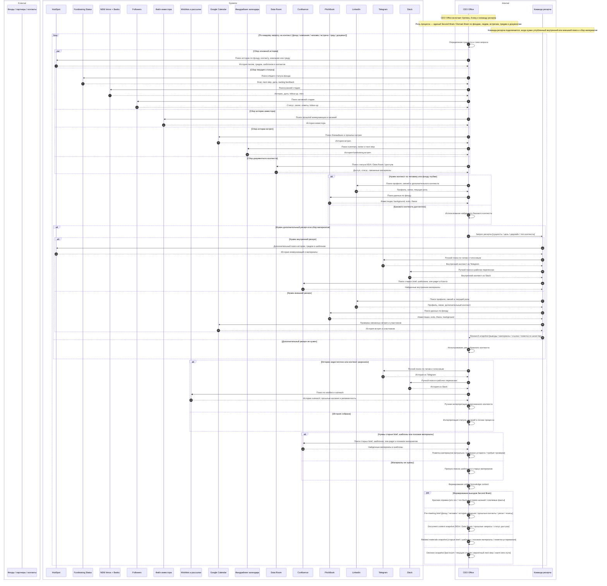
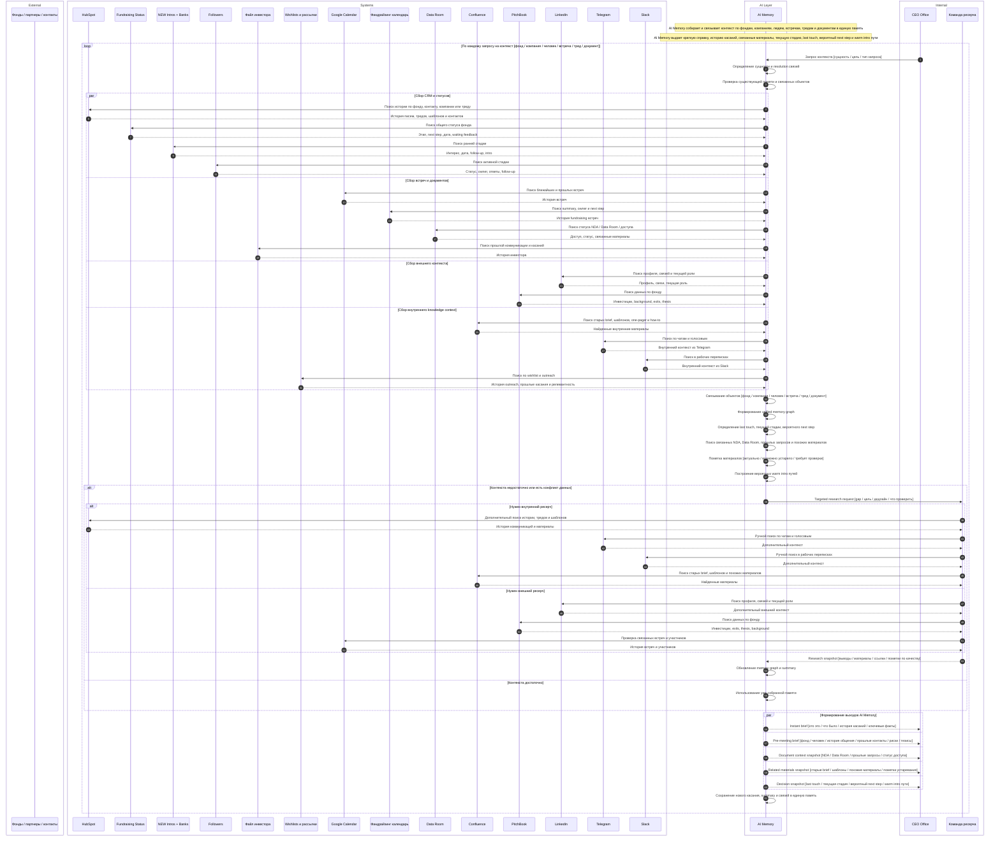
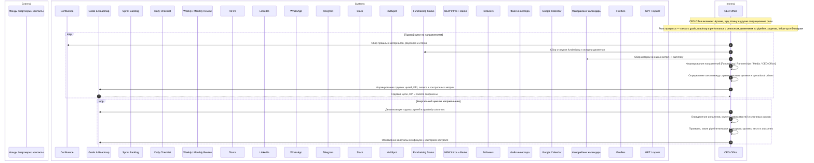
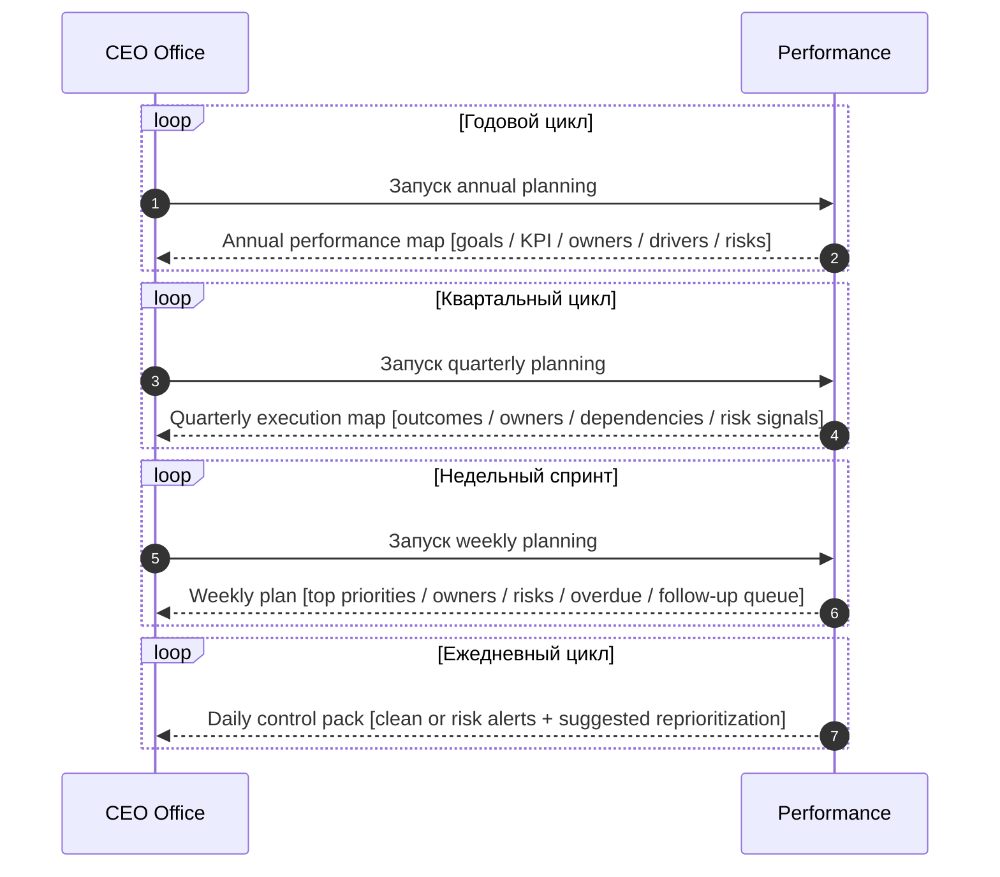

# CEO Brain — AS-IS / TO-BE Sequence Diagrams

Raw source sequence diagrams (mermaid `sequenceDiagram`) for each of the 10 modules.
Preserved verbatim for future reference and agent-buildout work.

---

## 1. AI Memory — Decision Quality

### AS-IS

### TO-BE

---

## 2. Performance — Effectiveness

### AS-IS

### TO-BE (abridged — see full raw source in `raw_sequences/` if needed)

---

## 3-10. Remaining modules (Tasks, Notes, Calendar, Email, Docs, Tables, Slides, Reports)

The full raw AS-IS/TO-BE sequences for all 10 modules were captured in the originating
strategy source. For brevity here we reference them by module name; the full literal
versions are preserved in the originating strategy conversation and the initiative
drawer text shown on the page summarises the TO-BE behaviour that each module delivers.

- **3. Tasks** — Tasks AI extracts, classifies, assigns and controls tasks end-to-end.
- **4. Notes** — Notes AI converts transcripts/notes into structured RU summaries and tracks meeting fate.
- **5. Calendar** — Calendar AI coordinates, classifies and routes meetings; delivers analytics.
- **6. Email** — Email AI normalises multi-channel inbox and drafts replies under human review.
- **7. Docs** — Docs AI picks templates, builds checklists, drives NDA/Data Room flows.
- **8. Tables** — Tables AI pre-fills, syncs and corrects structured registers.
- **9. Slides** — Slides AI assembles one-pagers, meeting packs and executive slides.
- **10. Reports** — Reports AI produces daily/weekly/monthly management reporting and nothing-lost control.
